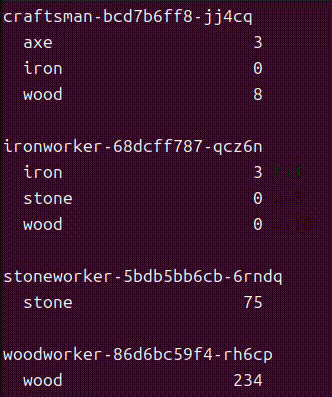

# Entry 5: Viewing Worker Inventory

## Introduction

In this entry, I will show how I improved the user experience while viewing the shops in a kingdom.  
To achieve this, I will introduce a few new Kubernetes concepts to effectively "watch" each shop's inventory.  
With the following changes, I can provide real time feedback to the user about the state of a kingdom.  

### Watch API

In addition to a REST API, some Kubernetes resources support change notifications through "watches".  
A watch allows a client to receive updates when a resource changes.  

There are different types of Watch Events, such as Added, Modified or Deleted Events.  
I will be using Modified Events to track changes in a worker pod.  

I can only view changes in the Kubernetes Object specification, not the actual data inside the pods.  
This means I need to move inventory data into the pod's specification...

### Annotations

[Annotations](https://kubernetes.io/docs/concepts/overview/working-with-objects/annotations/) are used to store arbitrary metadata about Kubernetes objects.  
Annotations have a useful property that they can be updated without officially changing the underlying object.  
Since our shops are created by deployments, most changes to the pod specification will trigger a new pod to be created.  
This is because the deployment controller will see the change as a deviation from the desired state and will create a new pod to correct it.  

Luckily, annotations do not trigger this behavior, making them the perfect place to store the inventory data for each shop.

### Patching (and patching types)

In order to dynamically update the annotations of a pod, I will use the PATCH method of the Kubernetes REST API for Pods.  
Each time a worker pod's inventory changes, I can update the pod's annotations using a PATCH request that modifies the pod's specification.  

This requires each pod to be able to make a PATCH request to itself.  
Right now, the worker pods don't have a reference to themselves, so I need to add that to the pod environment in some way.

### Downwards API

The [Downward API](https://kubernetes.io/docs/concepts/workloads/pods/downward-api/) allows a pod, specifically a container in a pod, to access information about itself.  
I use environment variables to expose the pod's name and namespace to the worker container.  
With this information, the worker can easily make a PATCH request to its own pod to update the annotations with the current inventory.  

I use the Downward API to get the name of the pod.  
This is necessary because the worker pod is dynamically created by the deployment and I can't know the name ahead of time.  
There are many other useful fields that can make a pod aware of its own state, but I only need the pod name for this entry.

### Service Accounts

A small but important detail is that the worker pods needs to have the correct permissions to PATCH itself.  

This project has not ran into permissions issues yet because our intra-pod communication has been limited to using services with the default service account in the same namespace.  

[Service Accounts](https://kubernetes.io/docs/concepts/security/service-accounts/) can be used to grant a set of permissions to Kubernetes objects, such as pods.  
An example use case that we may explore in the future includes cross-namespace communication, or in our case, cross-kingdom communication.  

We add a service account to our namespace for our worker pods to use.  
As they exist in the same namespace as the pods they are patching, they can use the service account to gain permissions to PATCH themselves.

```yaml
{{- range .Values.kingdoms }}
apiVersion: v1
kind: ServiceAccount
metadata:
  name: civ-worker
  namespace: {{ .name }}
```

To give them these permissions, I must declare them and attach them to the service account.  
Then I can reference the service account in the Worker pod to pass the permissions to the worker container.

```yaml
spec:
  serviceAccountName: civ-worker # use the service account we created
```

### RBAC: Roles and Role Bindings

[RBAC](https://kubernetes.io/docs/reference/access-authn-authz/rbac/), or Role-Based Access Control, is a way to manage permissions in Kubernetes.  
This is a vast topic, but for this entry, I will focus on just what is needed to give my worker pods the ability to PATCH themselves.  

First a role is required to define the rules that represent a set of permissions.  
Permissions grant access to specific resources and actions on those resources.  

For our worker pods, I need to create a Role that allows a pod to PATCH pods in its own namespace.

```yaml
apiVersion: rbac.authorization.k8s.io/v1
kind: Role
metadata:
  name: pod-patcher
  namespace: {{ .name }}
rules:
  - apiGroups: [""]
    resources: ["pods"]
    verbs: ["patch"]
```

Then I need to create a RoleBinding that binds the Role to the Service Account I created earlier.  

```yaml
kind: RoleBinding
metadata:
  name: pod-patcher-binding
  namespace: {{ .name }}
roleRef:
  apiGroup: rbac.authorization.k8s.io
  kind: Role
  name: pod-patcher
subjects:
  - kind: ServiceAccount
    name: civ-worker
    namespace: {{ .name }}
```

These configurations make careful use of the namespace and name fields to create the relationship between service account, role, and role binding.  

### Summary

These changes allow worker pods to PATCH their inventory data into their own annotations.  
This gives me the ability to watch for changes to the annotations and parse that data to provide real-time updates to the user.  

## Project Changes

### Worker Logic

I updated the worker logic to PATCH its own annotations after any inventory change.  

This was as simple as creating a json object with the inventory data,

```go
data := map[string]any{
    "metadata": map[string]any{
    "annotations": inventory,
  },
}
dataBytes, _ := json.Marshal(data)
```

Then using `kubernetes.Clientset` to PATCH the pod with the data.

```go
clientset.CoreV1().Pods(namespace).Patch(ctx, podName, types.MergePatchType, dataBytes, patchOptions)
```

Notice the namespace and podName variables that I got from environment variables created by the Downward API.

### Go CLI Watch Command

With the inventory data being updated in the pod's annotations, I can now watch for changes to the shops in the kingdom.  

I added a new `watch` command that pretty prints out the inventory data for each shop.  
I added some terminal colors and formatting to make the output readable and intuitive.

Again, I used the `kubernetes.Clientset` to watch for changes to the shops in the kingdom.  
I only parse the `Modified` event type and send updates back to the CLI using a channel.  

```go
watch, err := clientset.CoreV1().Pods(namespace).Watch(ctx, listOpts)

for event := range watch.ResultChan() {
  pod, ok := event.Object.(*corev1.Pod)
  if !ok {
    continue // skip if the object is not a Pod
  }
  switch event.Type {
  case "MODIFIED":
    podModifiedChan <- podModifiedEvent{
      PodName:   pod.Name,
      Inventory: pod.Annotations,
    }
  }
}
```

Then I can parse the inventory data from the pod's annotations and print it to the terminal.



## Conclusion

[Previous Entry](entry4.md)  
[Back to Home](index.md)  
